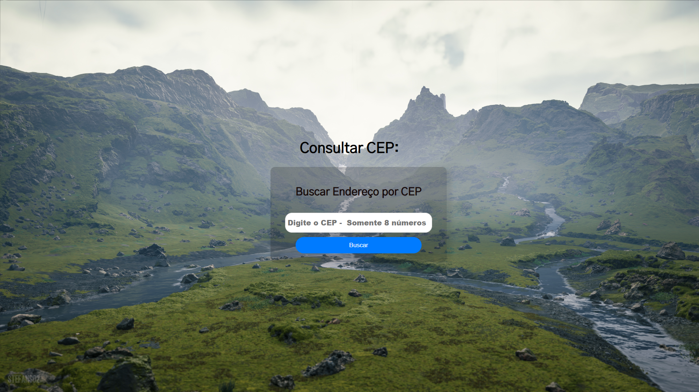
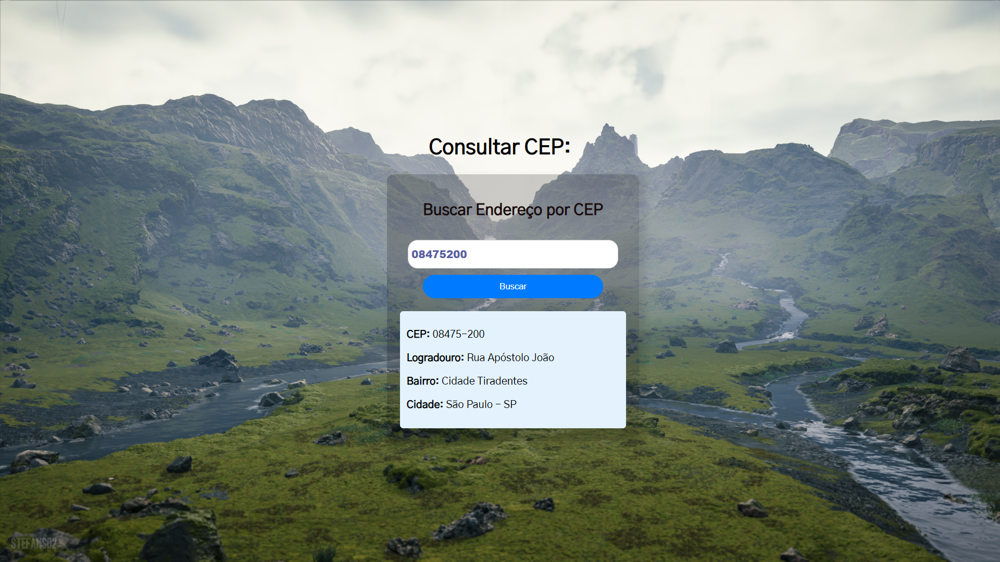
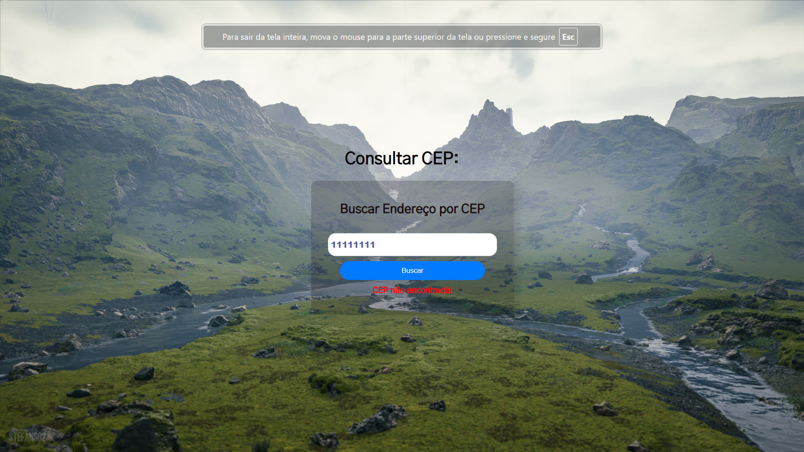

# Aula 08 - Consumo de API com fetch em typescript

`Projeto que consome a API do ViaCep para fazer uma consulta do CEP informado`

## Preview

Tela Inicial

Tela de exemplo da consulta

Tela de erro 1: CEP não encontrado

Tela de erro 2: CEP inválido

## Status
✅ Completo ✅
